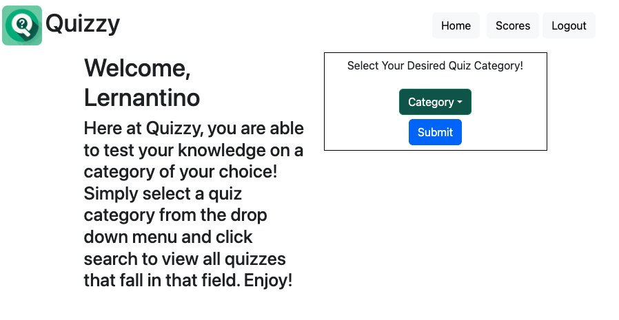
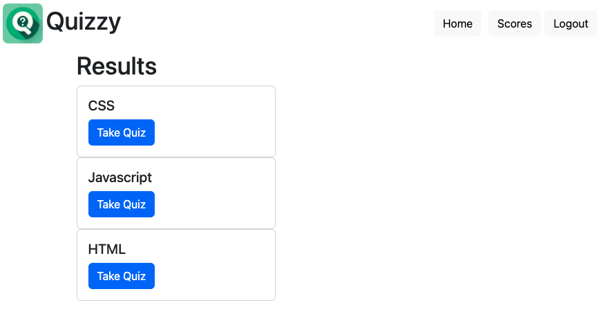
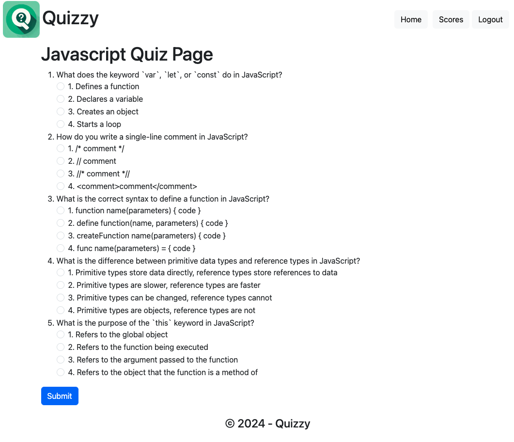
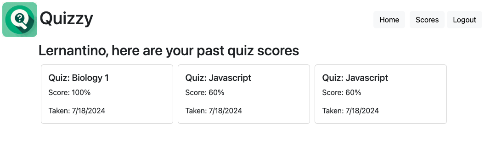

# Quizzy

Welcome to the Quizzy application! This project is designed to help users enhance their knowledge by taking quizzes on various topics. Users can log in, take quizzes, and see their scores.

## Live Demo

Check out the live application [here](https://quizzy-l7t0.onrender.com/).

Once the user is logged in or has signed up, they will be taken to the home page:


The user can then select a category of a quiz they'd like to take from the dropdown button that reads "Category". Once the user selects a category and clicks submit, they will be brought to a page with all the quizzes under that specific category.


Once the user clicks on which quiz they want to take, they will be brought to the actual quiz and can submit to see the score they got, with an option to retake the quiz.


Lastly, the user can click on the "Scores" tab at the top to see all of their past scores on quizzes they've taken.


## Table of Contents

- [Technologies Used](#technologies-used)
- [Installation](#installation)
- [Usage](#usage)
- [Contributing](#contributing)
- [License](#license)
- [Contact](#contact)

## Technologies Used

- **Frontend**: React, React Router DOM
- **Backend**: Node.js, Express.js
- **Database**: MongoDB, Mongoose
- **GraphQL**: Apollo Server, Apollo Client
- **Authentication**: JSON Web Tokens (JWT), bcrypt
- **Deployment**: Render

## Installation

```
npm i 
```

## Usage
Sign Up: Create a new account by providing your username, email, and password.
Log In: Log in with your credentials to access the quiz.
Take Quiz: Navigate to the Take Quiz page and start the quiz.
Log Out: Log out from your account.

## Contributing
If you would like to contribute or use my code, please credit original developer. 

## License
This project is licensed under the MIT License. See the LICENSE file for details.

## Contact
If you have any questions or suggestions, feel free to reach out to the team via GitHub:

### Our Team
GitHub Links: 
- [Nell-GitHub](https://github.com/nvanschaack)

Thank you for using Quizzy! 
